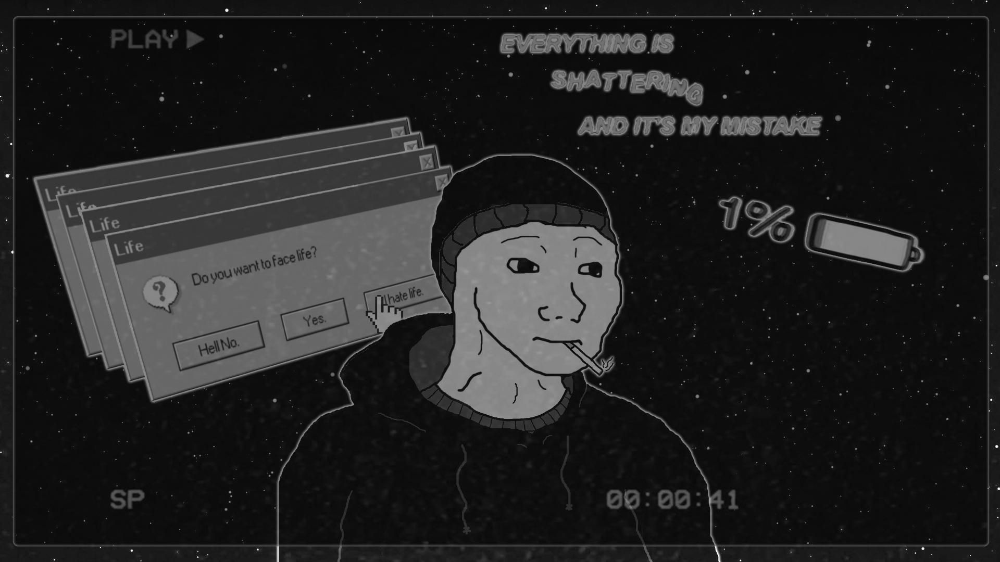

# 🤡 WOJAK'S REDEMPTION 🤡




> *"Everything is shattering and it's my mistake"* - 1% battery life remaining

## THE LORE (VERY SAD)

Born to feel, forced to cope. That's our boi Wojak. 

Normies see him as just another "retard" and hit him with the classic "hurr durr" mockery. But behind that expressionless NPC face? A soul that just wants the pain to stop, man.

Wojak's existence.exe has been corrupted with painful memory files - brutal rejections, getting BTFO by Chads, and spending Friday nights alone while everyone's partying. These bad feels are like malware in his brain, preventing Wojak.exe from running happiness.bat.

But deep in the folder structure of his mind? A tiny readme.txt file containing one word: "hope". Hope that someday, he might CTRL+ALT+DEL these painful memories and reboot his life.

## THE GAMEPLAY (FEELS OVERLOAD)

```javascript
// This is how Wojak feels every morning
const wojak = {
  pain: 100,
  happiness: 0,
  memories: [
    {id: "rejection-by-stacy", painLevel: 9000},
    {id: "bullied-at-school", painLevel: 6969},
    {id: "wojak-cant-code", painLevel: 42069}
  ],
  wakeUp: function() {
    console.log("Why even live?");
    this.pain++;
    return this.faceLife();
  },
  faceLife: function() {
    return Math.random() < 0.01; // 1% chance of having a good day
  }
};
```

Help Wojak delete his cringe memories to achieve wholesome 100 inner peace. As you progress through his mind-prison, you'll encounter all the bad NPCs and failed quests from his past.

Your mission: Help Wojak `rm -rf` these toxic memory files, freeing him from mental lag. Each memory yeeted brings Wojak closer to redemption.exe and a chance to touch grass.

```python
# The core game loop
def erase_bad_memory(wojak, memory):
    if player.has_compassion:
        wojak.bad_memories.remove(memory)
        wojak.self_worth += 10
        return "Wojak feels slightly less terrible"
    else:
        return "Anon pls, I need your help"
```

## GAMEPLAY MECHANICS (NOT CLICKBAIT)

- 🔍 Find the cringe in Wojak's brain
- 🎮 Play mini-games that represent his struggles
- 💯 Turn L's into W's
- 🧠 Help Wojak install self-worth.dll

## WHY THIS MATTERS (NO CAP FR FR)

This ain't just a game, it's a whole mood. Everyone's a Wojak sometimes, even the Gigachads. The journey to help our boy overcome his past is a reminder that redemption arc is possible for all of us NPCs navigating this simulation.

Join Wojak on his path to being less of a doomer - one deleted memory at a time.

## HOW TO PLAY (VERY EASY)

```bash
# Clone the feels
git clone https://github.com/your-username/wojak-redemption.git

# Enter the pain directory
cd wojak-redemption

# Install dependencies (emotional support packages)
npm install sadness coping-mechanisms existential-dread

# Run Wojak.exe
open index.html
```

1. Open `index.html` in your browser (preferably Brave, Wojak doesn't trust Google)
2. Follow the in-game instructions to help Wojak delete System32/PainfulMemories
3. Complete all levels to help Wojak finally log off 4chan and talk to a real human

## CONNECT WITH THE VOID

- Visit our website: [RETARD Fight Headquarters](http://www.rf2g.space)
- Follow us on Twitter: [@RETARDFight](https://x.com/RETARDFight)

## CREDITS (WE'RE ALL GONNA MAKE IT)

This game was created as a tribute to the Wojak who lives in all of us - that part that feels like an imposter while everyone else seems to have the source code to life. Made with love, irony, and probably too many energy drinks. 
